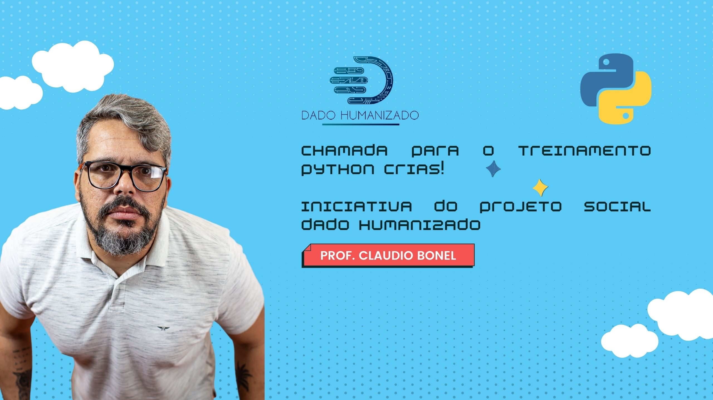
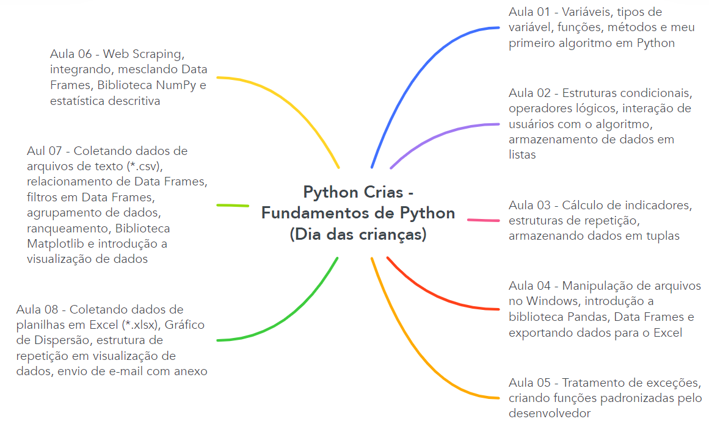

# Projeto Dado Humanizado! Python Crias

Trienamento GRATUITO - Python Cria: da faixa branca a verde
 
 
Para realizar o treinamento, você pode desenvolver utilizando o VS Code habilitado para Python (que é o que utilizo). A instalação é simples! Basta seguir o tutorial: https://code.visualstudio.com/docs/languages/python
 

## Vídeo de apresentação

## Sobre o que é?

Faaalaaaa coisa rica! Td bem com vc?
 
Bem-vindo a mais uma iniciativa do projeto Dado Humanizado! O Python Crias!!!!
 
Desta vez, vamos entregar um treinamento de Fundamentos de Python, totalmente GRATUITO, visando te capacitar no desenvolvimento de algoritmos.
 
O Treinamento é GRATUITO mas, conto com sua doação para que possamos distribuir presentes para 200 crianças de favelas em Jacarepaguá, Zona Oeste do RJ (Morro da Covanca, Pendura Saia, Caixa D'água e Renascer), em parceria com o CMS Jorge Saldanha! 
 
Em troca da sua doação, além de vc ter o sentimento de estar cumprindo com o seu dever social...vc receberá um certificado de 16 horas da Dadoteca, válido em todos o universos existentes do multiverso e até no metaverso!
 
Lembrando que a cada R$ 1,00 doado, eu vou doar mais R$ 1,00! Ou seja, se chegarmos a R$ 1.000,00, eu vou doar mais R$ 1.000,00!
 
Bonezinho, eu to quebrado! Não tenho como doar! Mas, preciso muito desse certificado! Como fazer?
 
Fala comigo! Manda um e-mail pra mim (contato@profclaudiobonel.com.br), que vou te entregar o certificado sem te pedir nada! Blz?
 
Todos/as que realizarem a doação, receberão a prestação de contas e as fotos da entrega, blz? Caso ainda esteja com dúvida, por favor me chame para que te apresente as prestações de contas anteriores!
 
A educação só tem sentido, se você é capaz de ver sentido na educação! Pratique a educação! Compartilhe a educação! Utilize a educação para mudar a vida de outras pessoas! Viva diariamente a educação!
 
Ainda tem duvida? Fale comigo!
 
Tmj e boas análises!
 
Bonel

## Como doar?

Acesse >> https://apoia.se/pythoncrias
 
Sua doação fará com que uma criança, possa curtir o dia de forma mais leve e você ainda leva um Certificado pra casa! :)

## Aonde assisto as aulas?

Em meu canal do Youtube: http://youtube.com/c/ClaudioBonel
 
Para acessar diretamente, acesse a lista Python crias: https://www.youtube.com/watch?v=5rjzp_v_Bxc&list=PLPP4r1UqnhGp_qRQYP0d9ipLwjFKb_EQ4

## Conteúdo do treinamento

## Contatos

E-mail: contato@profclaudiobonel.com.br
 
Instagram: @bonelclaudio
 
LinkedIn: http://br.linkedin.com/in/bonel